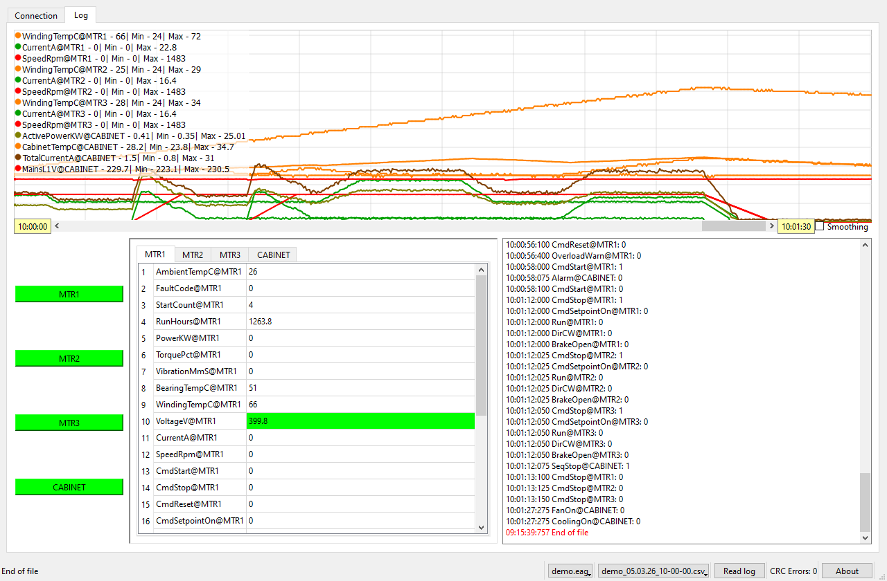
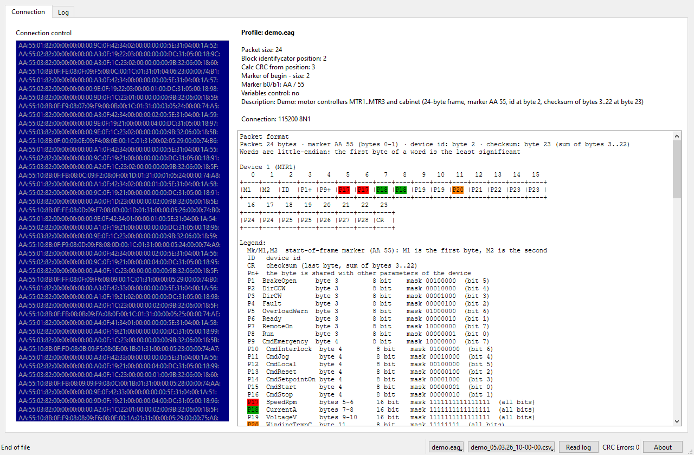
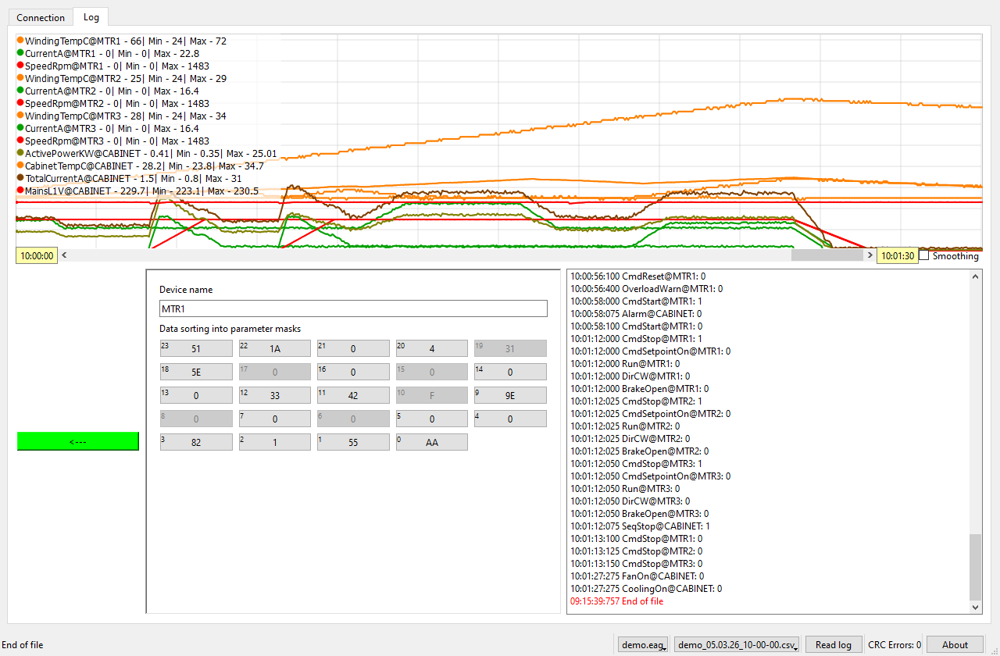
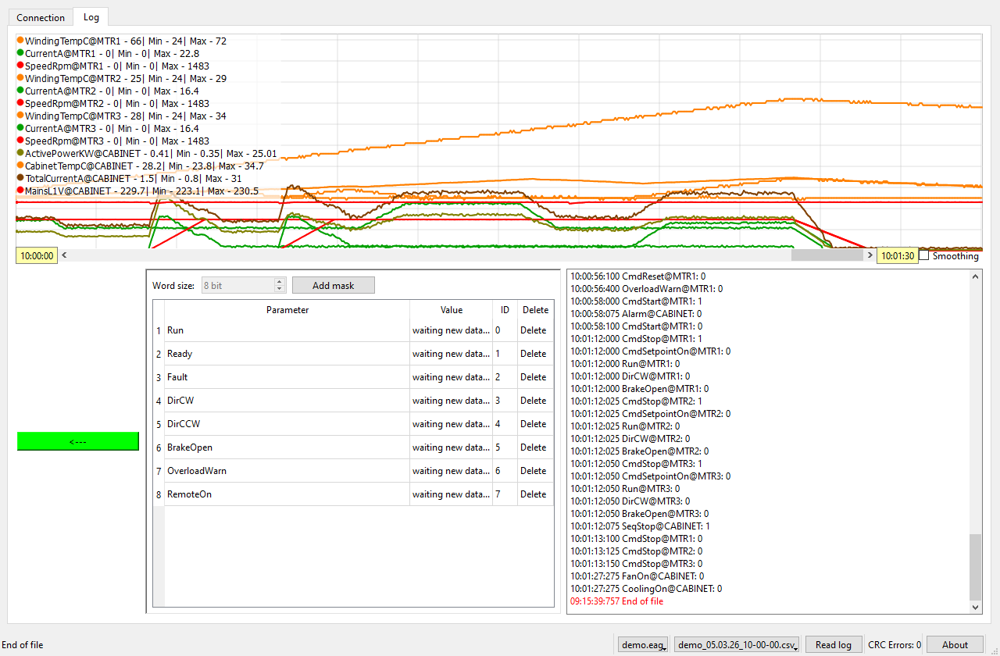
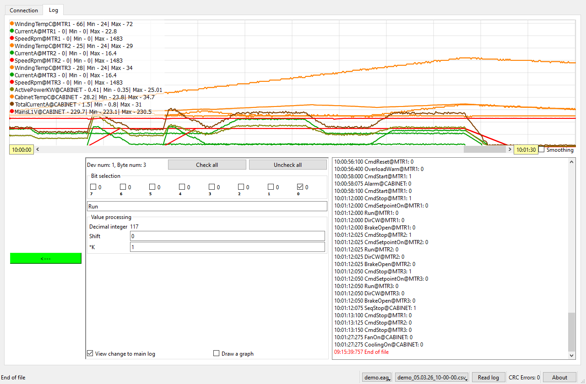

# etrodiag

**etrodiag** is a Qt desktop tool for capturing, decoding and logging a custom
serial protocol spoken by microcontrollers that share one data line and talk to
each other master-slave in a ring. It turns raw frames into named, timestamped
values: you describe the packet layout with bit/byte masks, and the app shows the
result in a text log, in per-device value tables and on a live graph, or writes it
to a log file.

> All screenshots below were taken with the bundled **demo profile and demo log**
> (`demo/`), so they show real data instead of a mock-up.

## Screenshots

### Monitoring



The monitoring tab holds the live graph, the device buttons, the per-device value
tables and the text log. The graph legend lists every curve
(`Parameter@Device - value | Min | Max`); the log below shows the timestamped
value changes.

### Connection and packet format



The connection tab contains the serial console (raw hex), the connection
parameters read from the profile (packet size, node-id position, checksum start,
marker, description) and an auto-generated packet diagram with a legend that maps
every byte and parameter of the protocol.

### Device settings



Clicking a device button opens its editor: the device name and the byte/word
buttons (each shows the byte index in the corner and its current value). All
other device buttons collapse into a `"<---"` button that returns to the tables.

### Byte masks



Clicking a byte/word button opens the list of masks defined for it. The word size
(8/16/32 bit) is chosen here, and every mask can be edited or deleted.

### Mask editor



A mask extracts a value from an 8/16/32-bit word: choose the bits, a shift that
moves them to the start, and a multiplier to scale the result. A mask can also be
written to the text log and drawn on the graph.

## Features

- **Serial capture and framing** - reads a port with the usual settings
  (baud rate, data bits, parity, stop bits, flow control) and reassembles
  fixed-size frames with a begin marker and a sum checksum. After a corrupted
  frame it re-synchronises automatically by shifting one byte.
- **Configurable protocol** - packet size, node-id byte position, checksum start
  position, and 0/1/2 marker bytes all come from the profile.
- **8/16/32-bit words** - bytes can be combined into words (little-endian: the
  first byte of a word is the least significant).
- **Bit/byte masks** - any bit pattern over a word, with a shift and a multiplier
  to scale the raw value into engineering units.
- **Text log** - timestamped values and messages for the masks that are marked
  "view in log".
- **Per-device value tables** - one table per device, pre-filled from the profile,
  updated live with changed values highlighted.
- **Live graph** - a scrolling curve per graph-enabled mask, with a legend
  (current value plus min/max, resettable per curve), curve hide/show, pause
  (gap) handling, a log-navigation slider, a hover readout of all values at the
  cursor position, and optional display smoothing.
- **Connection diagnostics** - a CRC error counter, an online/offline watchdog per
  device and an "end of file" indicator when replaying a log.
- **Profiles** - one profile per device network, storing the protocol and the
  masks. Saves are staged (`<profile>.eag.tmp` / `.bak`) and the user is prompted
  to keep or discard changes. The COM port is deliberately not stored.
- **Logs** - a text log (`.log`), a raw frame log (`.csv`, the file that "read
  from file" replays) and JSON lines (`.json`).
- **Offline replay** - instead of a live port you can read a recorded `.csv`
  log, which drives the whole pipeline (framing, masks, tables, graph) without
  hardware.
- **Android** - the project also builds for Android (`android/` Gradle project).

## How it works

```
serial port ──► frame assembler ──► device data ──► masks ──► log / tables / graph
   or .csv           (marker+CRC)     (per node)   (bit/byte)   (timestamped)
```

- **Frames.** A packet has a fixed size and a begin marker; the node id of the
  transmitter sits at a configurable byte, and the last byte is a checksum over
  the bytes that follow the marker. The default layout is a 40-byte frame with
  the marker `FF` as the first byte, the node id at byte 38 and the checksum in
  byte 39; the demo uses 24-byte frames with the marker `AA 55`, the node id at
  byte 2 and the checksum at byte 23.
- **Words.** Each byte of a packet can be treated on its own or combined with its
  neighbours into a 16- or 32-bit word.
- **Masks.** A mask selects some bits of a word (`00000001`, `1111111111111111`,
  ...), shifts them to the least significant position and multiplies the result
  by a coefficient, producing the displayed value. The app compares each new value
  with the previous one and only highlights or logs real changes.
- **Devices.** Every node id seen on the line gets a button. Opening it shows one
  button per byte/word; opening a byte shows its masks.
- **Profiles and logs.** A profile describes one device network (protocol plus
  masks); logs record the decoded values (text/JSON) or the raw frames (CSV) for
  later replay.

## Demo data

`demo/` contains a ready-to-use demo network: three motor controllers
(`MTR1..MTR3`) and a cabinet (`CABINET`).

```
demo/Profiles/demo.eag
demo/Logs/demo_05.03.26_10-00-00.csv
```

Copy those folders next to the executable (where the app keeps its `Profiles` and
`Logs` directories), pick `demo.eag` in the profile menu and then read the CSV via
the port menu -> "Read from file". The demo log runs a short scenario with
run/ready/fault transitions and start/stop commands; only the status and command
masks are flagged "view in log", so the text log shows exactly those events.

See [`demo/README.md`](demo/README.md) for details.

## Building

Requirements: **Qt 6** (widgets and serialport modules) and a C++17 compiler.
The project uses **qmake**:

```sh
qmake etrodiag.pro
make          # or mingw32-make / nmake, depending on the kit
```

On Windows with Qt's MinGW kit, make sure the Qt toolchain's `bin` directory is
first on `PATH` so that `make` and the compiler come from the same kit.

An Android kit is supported as well (`ANDROID_ABIS = arm64-v8a x86_64`).

## Tests

The pure protocol logic (framing, checksum, word assembly, mask math, profile
parsing and the shared settings model) has a Qt Test suite:

```sh
cd tests/build
qmake ../etrodiag_tests.pro
make
./debug/etrodiag_tests      # Windows; the binary name follows the kit
```

## Repository layout

| Path            | Contents                                                        |
| --------------- | --------------------------------------------------------------- |
| `*.cpp/*.h/ui`  | The application sources (main window, forms, protocols, graph).  |
| `qtcsv/`        | Vendored CSV library used by the logger.                         |
| `tests/`        | Qt Test suite for the protocol logic.                            |
| `demo/`         | Demo profile and demo log (see above).                           |
| `screenshots/`  | Screenshots used in this document.                               |
| `android/`      | Android packaging (Gradle project).                              |
